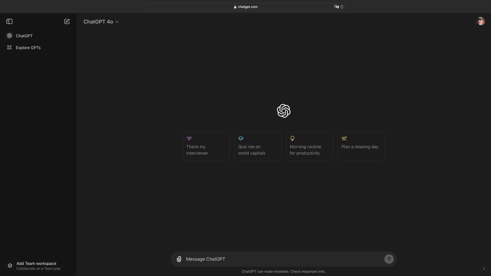

# Center and stylize the ChatGPT prompt box
⭐️ This repo, if you find it useful!

## Purpose
If you deliver ChatGPT training videos (live or recorded) and your browser is full-screen, you know, subtitles or ads usually overlay the prompt.

The solution? Move the prompt to the center of the screen with a local Javascript injection!

## Prerequisites
1. You will need [Tampermonkey](https://www.tampermonkey.net) or some other so-called `script injection` plugin installed in your browser
2. Go to ChatGPT and ensure you are on the page where you see chats (so you can prompt), and then make a note of the URL. In the US, mine is `https://chatgpt.com`

## Installation
1. In this repo, find the Tampermonkey code and copy the raw text
2. With your browser running, run Tampermonkey and create a new script
3. Replace the default code Tampermonkey creates with the code on my site
4. _Optional_: At the top of the code, you will see a line like this:
`// @match        *://chatgpt.com/*`
If your ChatGPT URL differs, replace mine with yours (e.g., `chatgpt.co.uk`)
5. Save the Tampermonkey code
6. In the Tampermonkey dashboard, make sure the script is enabled

## Usage
1. Go to https://chatgpt.com (or your ChatGPT URL)
2. When the prompt is in focus (meaning you select the text area or it is already selected), it will display in the middle of the page with a colorful background so it stands out (see image below)
3. Type your prompt and press enter/return on your keyboard (you can even use shift-enter for longer prompts!)
4. If the prompt box is in your way, select an area outside the box, and it will go back down to the bottom of the page where it exists by default

While the code may change over time, you should expect to see the prompt appear in the center of the page, as shown in the following image:

## Temporarily turn off the code
You can disable the code in two ways: by disabling Tampermonkey and by disabling the code.

### Option #1: Turn off Tampermonkey
If you are only using Tampermonkey to run the code in this repo, then disable Tampermonkey:
1. Open your browser, select the Tampermonkey icon, and deselect the `enabled` option

### Option #2: Turn off the code
In this scenario, the Tampermonkey extension will continue to run, but the prompt code from this repo will not
1. Open your browser, select the Tampermonkey icon, and select the `Dashboard` option
2. Locate the script from this repo and select the `enabled` option, which will switch it off

## Turn the code back on
Follow the steps in the previous section, and the code will run again.

## Known limitations/workarounds
At the moment, the following functionality does not work, mostly because I did not have the time to figure it out:

**Attach button does not work**
_Issue_: When the prompt bar is selected and you press the `attach` (paperclip) icon, the prompt box is restored to its default location.
_Workaround_: Drag and drop files into the chat space.

_Issue_: When you press the send (up arrow) button, the prompt box is restored to its default location.
_Workaround_: Press your keyboard's return (or enter) key.

_Issue_: You want to move the prompt box to its original location so you can read the content on the page.
_Workaround_: Select anywhere on the page, and the prompt box will return to its default location.

## Delete the code
If you'd like to remove Tampermonkey, you can find the instructions on their [site](https://www.tampermonkey.net).

If you want to remove this repo's code you put in Tampermonkey:
1. Open your browser
2. Select the Tampermonkey extension and then select the `Dashboard` option
3. Locate the code and then click the `trash` icon to delete it

## Improve safety and security
Personally, I like to limit access to extensions installed on my browser. Depending on the browser you are using, you should be able to:
1. Limit Tampermonkey to only run on sites where your code will run (like chatgpt.com)
2. Limit Tampermonkey's ability to run during certain types of sessions. For example, you could disable the extension for private browsing or when using certain profiles, like a work profile

Since all browsers treat extensions a little differently, I do not provide extensions here.

## License
This code is free to use. 
If you do share the code, I would appreciate a mention:
* https://billtalksai.com
* https://www.linkedin.com/in/williamraymond/
* https://github.com/BillRaymond
* https://github.com/BillRaymond/center-chatgpt-prompt-box

## PRs
If you make improvements or variations and feel like sharing them, please send a standard PR letting me know what changes you made and why. If I like it, I will add it!

## No Liability
I claim no liability for this code or its supporting tools. When using ChatGPT, your browser will run a third-party extension (Tampermonkey) with which I have no affiliation. Tampermonkey then injects code into your browser using the content the browser is displaying. Know what you are doing!
