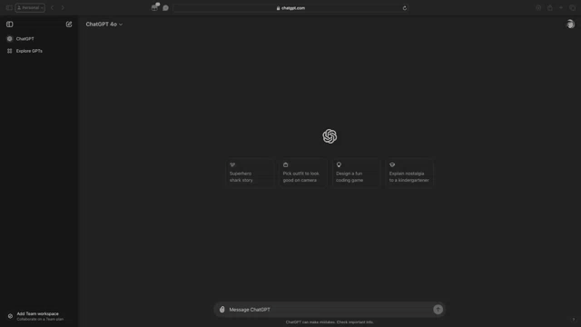

# Center and stylize the ChatGPT prompt box
⭐️ This repo, if you find it useful!

## Purpose
The primary way to get things done with ChatGPT is with a prompt. If you are training or doing prompts over a live or recorded feed, there is a strong likelihood that subtitles, ads, or other UI elements will appear in that lower quadrant of the screen. There are many solutions to fixing this, like zooming in and out, resizing your browser, etc. But why not just put the prompt in the center of the page with a nice visual to draw people's attention? That is the purpose of this utility.

## Installation
1. Install the [Tampermonkey](https://www.tampermonkey.net) extension for your browser of choice (I only tested Safari on the Mac)
2. With your browser running, run Tampermonkey and create a new script
3. Replace the default code Tampermonkey creates with the code on my site
4. Save the Tampermonkey code

## Usage
1. Go to https://chatgpt.com
2. When the prompt is in focus (meaning you select the text area or it is already selected), it will display in the middle of the page with a colorful background so it stands out
3. Type your prompt and press enter/return on your keyboard (you can even use shift-enter for longer prompts!)
4. If the prompt box is in your way, select an area outside the box, and it will go back down to the bottom of the page where it exists by default

## Limitations
At the moment, the following functionality does not work. If you have some ideas to 

## License
This code is free to use and can be distributed by anyone at no cost. 
If you do share the code, I would appreciate a mention:
* @BillRaymond
* https://github.com/BillRaymond
* https://github.com/BillRaymond/center-chatgpt-prompt-box

If you make improvements or variations and feel like sharing them, please send a PR. If the code runs and I think it is helpful for the scenarios I need it for, I will give you an honorable mention.
